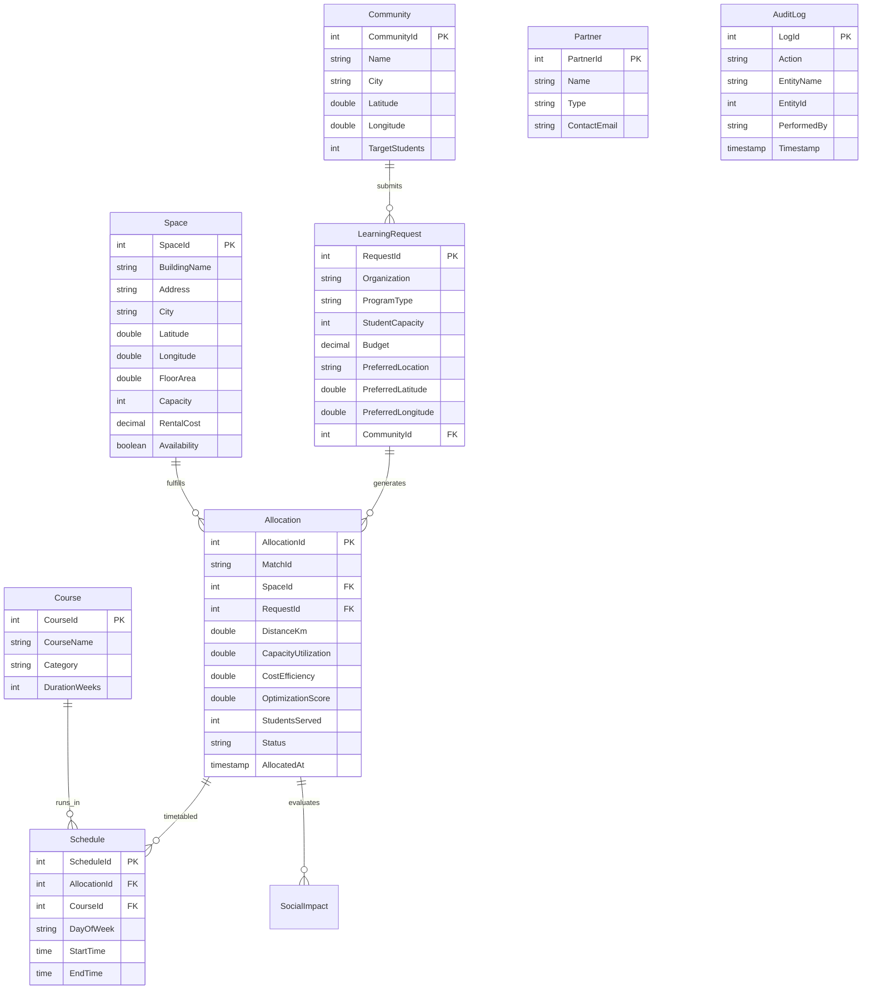

# 04. Database Design & Entity Relationships

## 1. Entity-Relationship Diagram (Mermaid)

---

## 2. Table Schema Overview

### 2.1 Spaces
- `SpaceId` (Serial, PK)
- `BuildingName` (VARCHAR(150), NOT NULL)
- `Address` (VARCHAR(250), NOT NULL)
- `City` (VARCHAR(100), NOT NULL)
- `Latitude` (DOUBLE PRECISION, NOT NULL)
- `Longitude` (DOUBLE PRECISION, NOT NULL)
- `FloorArea` (DOUBLE PRECISION, NOT NULL)
- `Capacity` (INT, NOT NULL)
- `RentalCost` (NUMERIC(12,2), NOT NULL)
- `Availability` (BOOLEAN, DEFAULT TRUE)

### 2.2 LearningRequests
- `RequestId` (Serial, PK)
- `Organization` (VARCHAR(150), NOT NULL)
- `ProgramType` (VARCHAR(100), NOT NULL)
- `StudentCapacity` (INT, NOT NULL)
- `Budget` (NUMERIC(12,2), NOT NULL)
- `PreferredLocation` (VARCHAR(250), NOT NULL)
- `PreferredLatitude` (DOUBLE PRECISION, NOT NULL)
- `PreferredLongitude` (DOUBLE PRECISION, NOT NULL)
- `CommunityId` (INT, FK -> Communities)

### 2.3 Allocations
- `AllocationId` (Serial, PK)
- `MatchId` (VARCHAR(50), UNIQUE)
- `SpaceId` (INT, FK -> Spaces)
- `RequestId` (INT, FK -> LearningRequests)
- `DistanceKm` (DOUBLE PRECISION)
- `CapacityUtilization` (DOUBLE PRECISION)
- `CostEfficiency` (DOUBLE PRECISION)
- `OptimizationScore` (DOUBLE PRECISION)
- `StudentsServed` (INT)
- `Status` (VARCHAR(50))
- `AllocatedAt` (TIMESTAMP WITH TIME ZONE)
